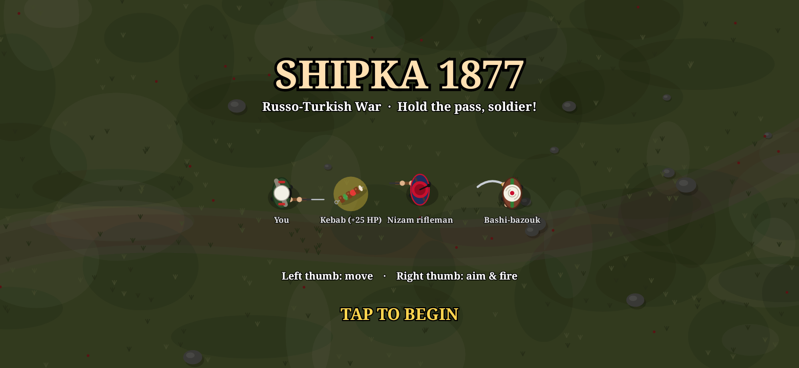
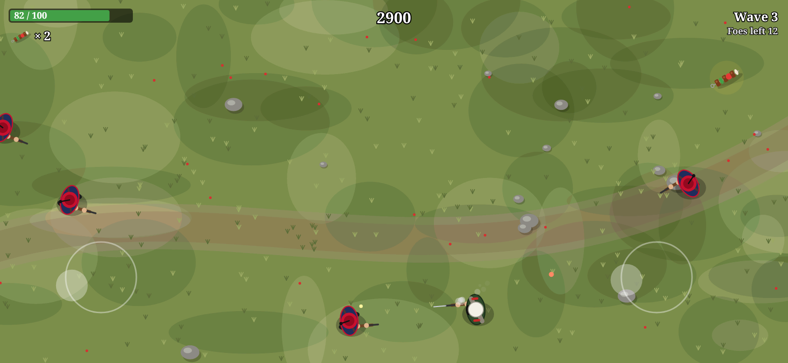

# Shipka 1877

A small top-down twin-stick shooter for Android, written in Kotlin. You are a Russian infantryman
holding the Shipka Pass during the Russo-Turkish War of 1877–78. Ottoman soldiers attack in waves,
and kebabs restore your health.




## Install

On your phone, open the [**Releases**](https://github.com/mortargoblin/android_game/releases/latest) page,
download `shipka-1877-<version>.apk` from the assets and open it. You'll need to allow installs from
unknown sources. Requires Android 5.0 (API 21) or newer.

## How to play

- **Left thumb:** move. The joystick appears wherever you touch the left half of the screen.
- **Right thumb:** aim. Your soldier fires automatically while you hold the right stick.
- **Kebabs** heal 25 HP and give 6 s of *kebab power*: faster movement and faster fire. Kebabs appear
  now and then, at the start of each wave and sometimes when an enemy is killed.

| Who | Looks like | Behaviour |
| --- | --- | --- |
| **You**, Russian infantry | Dark green tunic, white cap, red shoulder straps, rolled greatcoat, rifle with bayonet | |
| **Nizam** rifleman | Navy tunic with red trim, red fez with black tassel | Closes to firing range, strafes and shoots |
| **Bashi-bazouk** | Brown coat, green sash, white turban, curved sword | Fast, charges in for melee |

Each wave has more enemies than the last, and bashi-bazouks make up a larger share of them. Your best
score is saved on the device.

## Code

All graphics are drawn in code with `Canvas`, so the app has no image assets apart from the launcher
icon.

```
app/src/main/java/com/mortargoblin/shipka/
  MainActivity.kt   fullscreen activity
  GameView.kt       SurfaceView + game-loop thread (renders at ~720p and lets the compositor scale up)
  Game.kt           game state, waves, AI, collisions, input, HUD
  Entities.kt       player, enemies, bullets, kebabs, particles, virtual joystick
  Art.kt            procedural drawing of the soldiers, kebabs and the battlefield
```

## Building

### Android Studio / Gradle

Open the project in Android Studio, or run `./gradlew assembleRelease`. This is a standard AGP 8.7 +
Kotlin 2.1 project. Without signing variables set, release builds are signed with your local debug key.

### Releases (GitHub Actions)

`.github/workflows/release.yml` builds the APK on every push; you can download it from the run's
artifacts. Pushing a tag that starts with `v` also publishes a GitHub Release with the APK attached:

```sh
git tag v1.1 && git push origin v1.1
```

To sign every release with the same key, so that a new version installs over an old one, add these
repository secrets (Settings → Secrets and variables → Actions):

| Secret | Value |
| --- | --- |
| `KEYSTORE_BASE64` | `base64 -w0 release.keystore` |
| `SIGNING_STORE_PASSWORD` | keystore password |
| `SIGNING_KEY_ALIAS` | key alias |
| `SIGNING_KEY_PASSWORD` | key password |

Create a keystore with
`keytool -genkeypair -keystore release.keystore -alias shipka -keyalg RSA -keysize 2048 -validity 10000`.
If these secrets aren't set, each run signs with a throwaway debug key, and you'll have to uninstall
the old version before installing a new one.

### Without the Android SDK: `build_apk.sh`

`build_apk.sh` builds the APK by calling the low-level tools directly, without Gradle or the Android
Gradle Plugin. It uses:

- `aapt2`, `dalvik-exchange` (dx), `zipalign`, `apksigner` and the API 23 `android.jar`. On Ubuntu:
  `apt-get install aapt apksigner zipalign dalvik-exchange android-sdk-platform-23`
- a Kotlin compiler (1.9 or later), via `KOTLIN_HOME` or on `PATH`
- ProGuard, via `PROGUARD_HOME`

```sh
KOTLIN_HOME=/path/to/kotlinc PROGUARD_HOME=/path/to/proguard-7.6.1 ./build_apk.sh
# -> build/shipka-1877.apk
```

It signs with `debug.keystore`, which it generates on first run (the keystore isn't committed).
